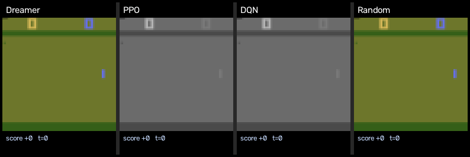
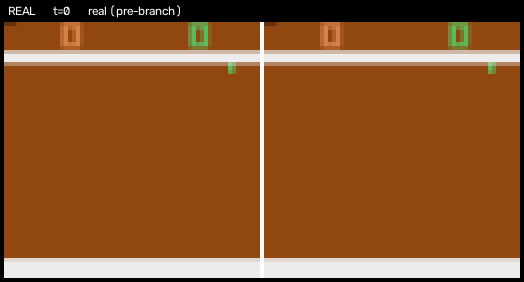
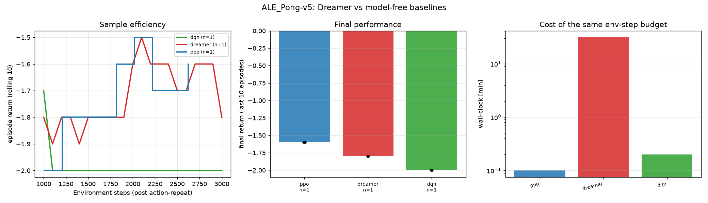

# Pipeline demo — artifacts from a smoke-scale run

**Read this before looking at the numbers.** Everything in this folder was
produced by a real end-to-end run of this repository, but on a budget small
enough to finish on a 4-core CPU: **3 000 environment steps per agent, one
seed, 100-step episode limit**. That is roughly 1/30 of the shortened
benchmark in [`RESULTS.md`](../../RESULTS.md) and ~1/600 of what Pong
actually needs. **No agent learned to play here**, and the returns below are
not evidence about Dreamer, PPO or DQN.

What it *is* evidence of: the pipeline runs end to end and every artifact
below is generated from recorded data — no hand-drawn figures, no mock-ups.
For the measured results, see [`RESULTS.md`](../../RESULTS.md) and the
"Benchmark results" / "Phase 2 results" sections of the
[README](../../README.md).

Open [`SHOWCASE.md`](SHOWCASE.md) for the whole set (GitHub renders it), or
[`index.html`](index.html) for the styled page (clone first — GitHub shows
HTML as source).

Dreamer, PPO, DQN and a random policy on the same seeds, each panel showing
that agent's own 64×64 input, its live score, and its final return once its
episode ends:



Left: what actually happened. Right: what the world model dreamed from the
same latent state, decoded to pixels — prior-only, the path the policy is
trained on. The red border marks where the dream takes over:





## What was run

| | |
|---|---|
| environment | `ALE/Pong-v5`, action repeat 4, 64×64, episode limit 100 steps |
| budget | 3 000 env steps per agent (Dreamer's 500 random prefill steps count toward it) |
| agents | Dreamer (from scratch), PPO, DQN (double+dueling), random |
| seeds | 1 — a bar with one dot under it is one sample, not a measurement |
| hardware | 4-core CPU, no GPU; Dreamer 500 updates at 0.26 updates/s |
| wall-clock | Dreamer 31.4 min, PPO 0.1 min, DQN 0.2 min |
| command | `scripts/make_demo.sh` (defaults are exactly this budget) |

## Results table (of *this* run — see the warning above)

| agent | final return (last 10 ep.) | best episode | wall-clock |
|---|---|---|---|
| PPO | −1.6 | 0.0 | 0.1 min |
| Dreamer | −1.8 | 0.0 | 31.4 min |
| DQN | −2.0 | +1.0 | 0.2 min |

With 100-step episodes almost nothing happens in a Pong point, so all three
agents sit within noise of each other near the truncated-episode floor. The
ordering here carries no signal.

The one thing that *did* move in 500 updates is the world model:
reconstruction error fell from 0.436 to **0.00033** per pixel, and the
open-loop prior rollout holds 0.00034 per pixel over 15 imagined steps —
visible in `assets/reconstruction_0.png` and `assets/open_loop_0.gif`.
The dream-vs-real correlation over 11 logged updates is meaningless at this
length and is included only to show the plot renders.

## Regenerating, at any scale

```bash
# this exact demo (CPU, ~35 min)
scripts/make_demo.sh

# something worth showing as evidence (GPU)
STEPS=100000 SEEDS="[0,1,2]" TIME_LIMIT=1000 DEVICE=cuda ROOT=experiments/real \
    scripts/make_demo.sh
```

The second command writes the same file names into `experiments/real/`, so
the page and every figure swap in unchanged once a real run exists.
