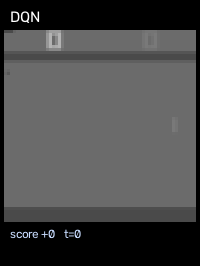
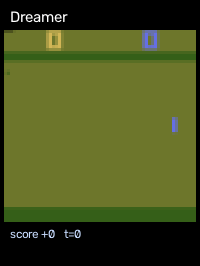
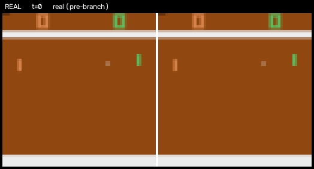
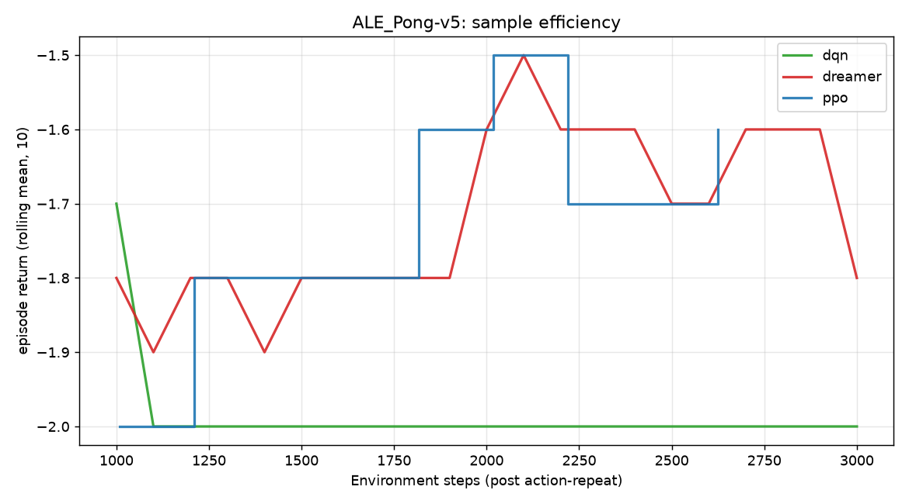
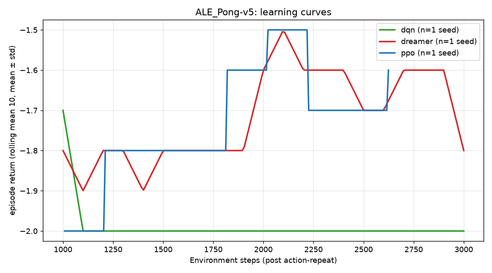
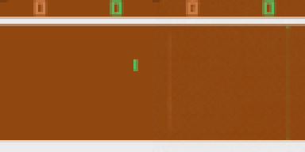
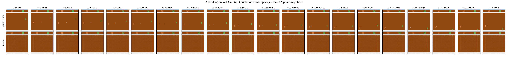
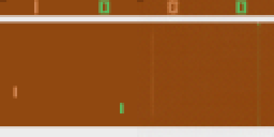

# ALE/Pong-v5 showcase

Generated 2026-09-19 by `viz/make_showcase.py` — no training, only artifacts already on disk.

> **Smoke-scale pipeline demo - 3000 env steps per agent, 1 seed, 100-step episodes, CPU. No agent learned to play; these artifacts show the pipeline, not a result. See docs/demo/README.md and RESULTS.md.**

## 1. It plays

Trained agents acting greedily in the environment, each panel showing exactly the 64x64 input that agent receives. Same seeds for every agent.


*ALE/Pong-v5, action repeat 4 — Dreamer: return +1.0 (best of 3), PPO: return -1.0 (best of 3), DQN: return -2.0 (best of 3), Random: return -2.0 (best of 3)*



*ALE/Pong-v5, action repeat 4 — Dreamer: return +1.0 (best of 3), PPO: return -1.0 (best of 3), DQN: return -2.0 (best of 3), Random: return -2.0 (best of 3)*



*ALE/Pong-v5, action repeat 4 — Dreamer: return +1.0 (best of 3), PPO: return -1.0 (best of 3), DQN: return -2.0 (best of 3), Random: return -2.0 (best of 3)*

## 2. It plays inside its own world model

Left: what actually happened. Right: what the RSSM dreamed from the same latent state, decoded to pixels — prior-only, the path the policy is trained on.


*pong-v5_branch0020_H15: left = real environment, right = decoded imagination*



*pong-v5_branch0060_H15: left = real environment, right = decoded imagination*

## 3. It learns faster than the model-free baselines

Episode return against environment steps (post action-repeat) — the sample-efficiency axis — and the wall-clock price of that efficiency.


*ALE Pong-v5 summary*



*ALE Pong-v5 env steps*



*ALE Pong-v5 learning curves*

### ALE Pong-v5 summary

| agent | seeds | env_steps | final_return_mean | final_return_std | best_episode | wall_clock_min |
|---|---|---|---|---|---|---|
| ppo | 1 | 2624 | -1.6 | 0.0 | 0.0 | 0.1 |
| dreamer | 1 | 3000 | -1.8 | 0.0 | 0.0 | 31.3 |
| dqn | 1 | 3000 | -2.0 | 0.0 | 1.0 | 0.2 |

final_return = mean over seeds of each run's last-10-episode mean; wall_clock = mean seconds of each seed's run, in minutes.


## 4. What each design choice bought

One Hydra override per variant, same budget and seeds as the base run.

_Not generated yet:_

```bash
python viz/ablation_summary.py
```

## 5. World-model diagnostics

Reconstructions, open-loop rollouts and the dream-vs-real return check behind the numbers above.



*open loop 0*



*open loop 0*



*open loop 1*
